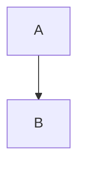

# Architecture Diagrams

This directory contains all Mermaid diagrams used in the FastAPI template documentation as individual `.mmd` files.

## Available Diagrams

| File                                                               | Description                    | Used In                                                                           |
| ------------------------------------------------------------------ | ------------------------------ | --------------------------------------------------------------------------------- |
| [`system-overview.mmd`](./system-overview.mmd)                     | High-level system architecture | [architecture-diagrams.md](../architecture-diagrams.md#system-overview)           |
| [`request-flow.mmd`](./request-flow.mmd)                           | HTTP request flow sequence     | [architecture-diagrams.md](../architecture-diagrams.md#request-flow-architecture) |
| [`database-postgresql.mmd`](./database-postgresql.mmd)             | PostgreSQL cluster setup       | [architecture-diagrams.md](../architecture-diagrams.md#postgresql-configuration)  |
| [`database-firestore.mmd`](./database-firestore.mmd)               | Firestore multi-region setup   | [architecture-diagrams.md](../architecture-diagrams.md#firestore-configuration)   |
| [`database-multi.mmd`](./database-multi.mmd)                       | Multi-database architecture    | [architecture-diagrams.md](../architecture-diagrams.md#multi-database-setup)      |
| [`clean-architecture.mmd`](./clean-architecture.mmd)               | Clean architecture layers      | [architecture-diagrams.md](../architecture-diagrams.md#clean-architecture-layers) |
| [`deployment-development.mmd`](./deployment-development.mmd)       | Development environment        | [architecture-diagrams.md](../architecture-diagrams.md#development-environment)   |
| [`deployment-production.mmd`](./deployment-production.mmd)         | Production deployment          | [architecture-diagrams.md](../architecture-diagrams.md#production-deployment)     |
| [`container-architecture.mmd`](./container-architecture.mmd)       | Docker container structure     | [architecture-diagrams.md](../architecture-diagrams.md#container-architecture)    |
| [`event-driven-architecture.mmd`](./event-driven-architecture.mmd) | Event-driven patterns          | [architecture-diagrams.md](../architecture-diagrams.md#event-driven-architecture) |
| [`security-architecture.mmd`](./security-architecture.mmd)         | Security layer flow            | [architecture-diagrams.md](../architecture-diagrams.md#security-architecture)     |
| [`testing-architecture.mmd`](./testing-architecture.mmd)           | Testing strategy overview      | [architecture-diagrams.md](../architecture-diagrams.md#testing-architecture)      |
| [`monitoring-observability.mmd`](./monitoring-observability.mmd)   | Observability stack            | [architecture-diagrams.md](../architecture-diagrams.md#monitoring--observability) |

## Usage

### Direct Rendering

Most modern IDEs and documentation platforms support Mermaid rendering:

- **GitHub/GitLab**: Automatic rendering in README files
- **VS Code**: Install "Mermaid Preview" extension
- **JetBrains IDEs**: Install "Mermaid" plugin
- **Notion**: Import `.mmd` files directly

### Documentation Integration

**MkDocs Material:**

````markdown
```mermaid
--8<-- "docs/diagrams/system-overview.mmd"
```
````

**Docusaurus:**

```mdx
import Mermaid from "@theme/Mermaid";
import systemOverview from "!!raw-loader!./diagrams/system-overview.mmd";

<Mermaid chart={systemOverview} />
```

**GitBook:**

```markdown

```

### Presentations

**Marp (Markdown Presentations):**

````markdown

````

**Reveal.js:**

- Use the Mermaid plugin
- Include `.mmd` files as external resources

### Editing

**Online Editors:**

- [Mermaid Live Editor](https://mermaid.live/)
- [Draw.io](https://app.diagrams.net/) (supports Mermaid import)

**Local Editing:**

- Any text editor with Mermaid syntax highlighting
- VS Code with Mermaid Preview for real-time rendering

---

These diagrams are maintained as separate files to enable:

- Easy integration into multiple documentation systems
- Version control of diagram changes
- Reuse across different projects and presentations
- Individual editing without affecting main documentation
